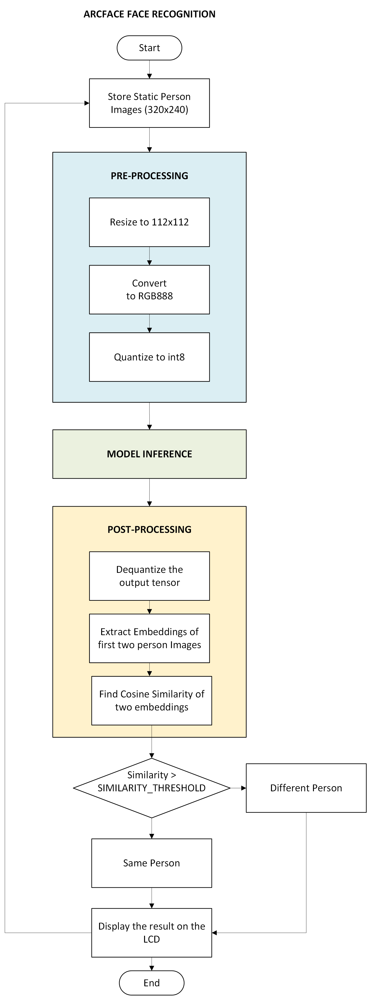

# ArcFace Pre-Trained Model for PSOC™ Edge

This code example demonstrates how to deploy the ArcFace Face Recognition model on the PSoC™ Edge MCU. The model generates 512 embeddings from 112x112 face images. Multiple static face images are stored on the PSoC Edge and provided as inputs to the model. The processing pipeline then compares the embedding outputs of two faces and determines whether they belong to the same person or different individuals.

## Licenses

Source Model: https://github.com/wm-quan/deepface-Arcface/tree/master

Sample Application and Deployable Binaries: https://github.com/Infineon/deepcraft-model-zoo-for-psoc/blob/main/LICENSE.txt

Model: https://github.com/Infineon/deepcraft-model-zoo-for-psoc/blob/main/ArcFace/licenses/MODEL_LICENSE.txt

Dataset: https://creativecommons.org/publicdomain/zero/1.0/

### Highlevel flow diagram

## Pre-requisites

1. Setup "PSOC&trade; Edge MCU: AI Hub vision deploy" Application, refer to the README at https://github.com/Infineon/mtb-example-psoc-edge-ml-aihub-deploy-vision for detailed setup and usage instructions.
2. This code example is configured to boot from the external OSPI flash, refer [Switching boot flow to an external OSPI](readme_assets/switching_boot_flow_to_ext_ospi.md) for the detailed steps

### Deployment steps

1. Once the "PSOC&trade; Edge MCU: AI Hub vision deploy" application is imported succesfully, follow the below steps to Deploy Arcface Face Recognition Vision model

2. Go to [Arcface Face Recognition FW Artifacts](https://github.com/Infineon/deepcraft-model-zoo-for-psoc/tree/main/ArcFace/fw) and copy all the .h and .a files to <application_workspace>/ml_pipeline_eur_libs directory

3. Open proj_cm55/Makefile and update the following variables for Arcface Face Recognition model
- NN_TYPE=float
- NN_MODEL_NAME=ARCFACE_FACE_RECOGNITION
- LDLIBS+=../ml_pipeline_eur_libs/ARCFACE_FACE_RECOGNITION_pipeline.a
- DEFINES+=ML_IMAGIMOB_CM55 MODEL_NAME=$(NN_MODEL_NAME) CY_ML_MODEL_MEM=.cy_socmem_data

4. Build the full project

5. Program the application to PSOC Edge HW

6. Once the application hex is successfully flashed to PSOC Edge HW, Arcface Face Recognition use-case will start running by default.

    

### Pre-Built Binaries

There is a pre-built FW binaray available for this use-case under "psoc_edge_fw_binary" directory that can be directly flashed onto PSOC Edge MCU using ModusToolbox™ Programmer tool.

For detailed flashing instructions, refer to [**ModusToolbox™ Programmer Documentation (Section 5.14)**](https://www.infineon.com/row/public/documents/30/44/infineon-modustoolbox-gui-user-guide-usermanual-en.pdf). Same steps applicable for flashing to external OSPI as well. 

---------------------------------------------------------

© Cypress Semiconductor Corporation, 2024-2025. This document is the property of Cypress Semiconductor Corporation, an Infineon Technologies company, and its affiliates ("Cypress").  This document, including any software or firmware included or referenced in this document ("Software"), is owned by Cypress under the intellectual property laws and treaties of the United States and other countries worldwide.  Cypress reserves all rights under such laws and treaties and does not, except as specifically stated in this paragraph, grant any license under its patents, copyrights, trademarks, or other intellectual property rights.  If the Software is not accompanied by a license agreement and you do not otherwise have a written agreement with Cypress governing the use of the Software, then Cypress hereby grants you a personal, non-exclusive, nontransferable license (without the right to sublicense) (1) under its copyright rights in the Software (a) for Software provided in source code form, to modify and reproduce the Software solely for use with Cypress hardware products, only internally within your organization, and (b) to distribute the Software in binary code form externally to end users (either directly or indirectly through resellers and distributors), solely for use on Cypress hardware product units, and (2) under those claims of Cypress's patents that are infringed by the Software (as provided by Cypress, unmodified) to make, use, distribute, and import the Software solely for use with Cypress hardware products.  Any other use, reproduction, modification, translation, or compilation of the Software is prohibited.
 
TO THE EXTENT PERMITTED BY APPLICABLE LAW, CYPRESS MAKES NO WARRANTY OF ANY KIND, EXPRESS OR IMPLIED, WITH REGARD TO THIS DOCUMENT OR ANY SOFTWARE OR ACCOMPANYING HARDWARE, INCLUDING, BUT NOT LIMITED TO, THE IMPLIED WARRANTIES OF MERCHANTABILITY AND FITNESS FOR A PARTICULAR PURPOSE.  No computing device can be absolutely secure.  Therefore, despite security measures implemented in Cypress hardware or software products, Cypress shall have no liability arising out of any security breach, such as unauthorized access to or use of a Cypress product. CYPRESS DOES NOT REPRESENT, WARRANT, OR GUARANTEE THAT CYPRESS PRODUCTS, OR SYSTEMS CREATED USING CYPRESS PRODUCTS, WILL BE FREE FROM CORRUPTION, ATTACK, VIRUSES, INTERFERENCE, HACKING, DATA LOSS OR THEFT, OR OTHER SECURITY INTRUSION (collectively, "Security Breach").  Cypress disclaims any liability relating to any Security Breach, and you shall and hereby do release Cypress from any claim, damage, or other liability arising from any Security Breach.  In addition, the products described in these materials may contain design defects or errors known as errata which may cause the product to deviate from published specifications. To the extent permitted by applicable law, Cypress reserves the right to make changes to this document without further notice. Cypress does not assume any liability arising out of the application or use of any product or circuit described in this document. Any information provided in this document, including any sample design information or programming code, is provided only for reference purposes.  It is the responsibility of the user of this document to properly design, program, and test the functionality and safety of any application made of this information and any resulting product.  "High-Risk Device" means any device or system whose failure could cause personal injury, death, or property damage.  Examples of High-Risk Devices are weapons, nuclear installations, surgical implants, and other medical devices.  "Critical Component" means any component of a High-Risk Device whose failure to perform can be reasonably expected to cause, directly or indirectly, the failure of the High-Risk Device, or to affect its safety or effectiveness.  Cypress is not liable, in whole or in part, and you shall and hereby do release Cypress from any claim, damage, or other liability arising from any use of a Cypress product as a Critical Component in a High-Risk Device. You shall indemnify and hold Cypress, including its affiliates, and its directors, officers, employees, agents, distributors, and assigns harmless from and against all claims, costs, damages, and expenses, arising out of any claim, including claims for product liability, personal injury or death, or property damage arising from any use of a Cypress product as a Critical Component in a High-Risk Device. Cypress products are not intended or authorized for use as a Critical Component in any High-Risk Device except to the limited extent that (i) Cypress's published data sheet for the product explicitly states Cypress has qualified the product for use in a specific High-Risk Device, or (ii) Cypress has given you advance written authorization to use the product as a Critical Component in the specific High-Risk Device and you have signed a separate indemnification agreement.
 
Cypress, the Cypress logo, and combinations thereof, ModusToolbox, PSOC, CAPSENSE, EZ-USB, F-RAM, and TRAVEO are trademarks or registered trademarks of Cypress or a subsidiary of Cypress in the United States or in other countries. For a more complete list of Cypress trademarks, visit www.infineon.com. Other names and brands may be claimed as property of their respective owners.
