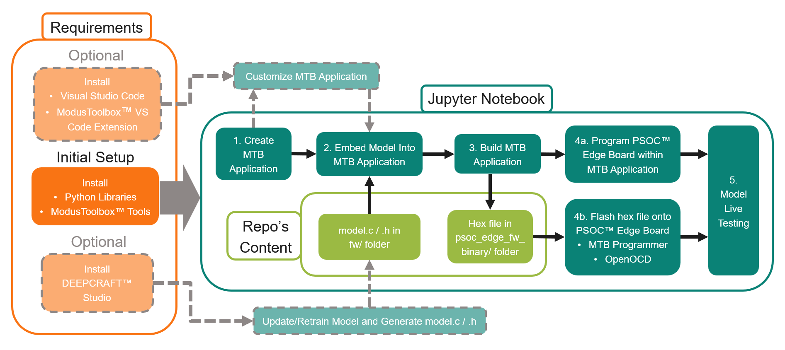

# Movement Type AI Model Deployment on PSOC™ Edge AI Kit

This project shows how to deploy a [DEEPCRAFT™ Studio Accelerator](https://github.com/Infineon/deepcraft-studio-accelerators) on the [PSOC™ Edge AI Kit (KIT_PSE84_AI)](https://www.infineon.com/evaluation-board/KIT-PSE84-AI) and run model inference on the Ethos-U55 NPU.

The accelerator used in this example is [Movement Type Detection](https://github.com/Infineon/deepcraft-studio-accelerators/tree/main/MovementTypeDetection) — a [DEEPCRAFT™ Studio](https://developer.imagimob.com/deepcraft-studio) Accelerator that uses IMU sensor data (accelerometer + gyroscope) to classify whether the user is shaking the board or turning it in circles.

The [PSOC™ Edge Machine Learning DEEPCRAFT™ Deploy Motion](https://github.com/Infineon/mtb-example-psoc-edge-ml-deepcraft-deploy-motion) code example, available also through the [ModusToolbox™ Software](https://www.infineon.com/design-resources/development-tools/sdk/modustoolbox-software), is used to create the firmware for the deployment of this specific accelerator.

The recommended workflow uses the **Jupyter notebook** (`movement-type-model-deploy.ipynb`) to parse the model, embed the edge code into a ModusToolbox™ application, build the firmware, program the board, and view live predictions — all from a single notebook.

------------------------------------------------------

## Contents

| Section | Description |
|--------|-------------|
| [1. Model Deployment](#1-model-deployment) | Run the Jupyter notebook `movement-type-model-deploy.ipynb` to deploy the provided model.c / .h AI model by following the main deployment workflow which uses the PSOC™ Edge code example as is |
| [2. (Optional) Update the Model with DEEPCRAFT™ Studio](#2-optional-update-the-model-with-deepcraft-studio) | Use DEEPCRAFT™ Studio to download the latest accelerator project, retrain the model for your specific use-case if needed and generate new edge code model.c / .h of the provided h5 model to be deployed as explained in Section 1 or Section 3 |
| [3. (Optional) Customized Deployment with VS Code](#3-optional-customized-deployment-with-vs-code) | Use Visual Studio (VS) Code and the functionalities of the ModusToolbox™ Assistant extension to customize and debug the PSOC™ Edge code example to fit your use-case. Deploy into your customized application the provided model.c / .h or the latest/retrained model, generated as described in Section 2 |
| [4. Requirements and Tools](#4-requirements-and-tools) | Clone repo, set up Python venv, and install ModusToolbox™ Tools. Optionally install ModusToolbox™ Programmer, DEEPCRAFT™ Studio, and/or VS Code with ModusToolbox™ Assistant extension |


## Workflow

The image below shows the expected workflow. Solid lines represent the main workflow using the **Jupyter notebook** (`movement-type-model-deploy.ipynb`) and the other content of this repository/project. Light colors and dashed lines are used for the optional parts. When possible, we used the abbreviation MTB for ModusToolbox™.

<a id="project-workflow"></a>




## Repository layout

- **fw/** – Quantized edge code files (`model.c`, `model.h`) generated from the Movement Type Detection DEEPCRAFT™ Studio Accelerator, including both preprocessor and neural network
- **models/** – H5 model file (`model.h5`) from the Movement Type Detection DEEPCRAFT™ Studio Accelerator, containing both preprocessor and neural network
- **psoc_edge_fw_binary/** – Prebuilt application `.hex` for KIT_PSE84_AI
- **src/** – Python helper modules
  - `studio_h5_parser.py` – Parse H5 model: classes, preprocessor, metrics, architecture
  - `modus_make.py` – Run ModusToolbox™ `make` targets, launch ModusToolbox™ Programmer, and flash `.hex` files via OpenOCD
  - `serial_monitor.py` – Serial port detection and terminal launcher helpers
- **movement-type-model-deploy.ipynb** – Notebook: parse model, embed edge code, build, program, and view live predictions

------------------------------------------------------

## 1. Model Deployment

The Jupyter notebook `movement-type-model-deploy.ipynb` walks you through the full deployment pipeline — from creating the ModusToolbox™ application to viewing live predictions. See the notebook for detailed step-by-step instructions.

### 1.1 Prerequisites

- PSOC™ Edge AI Kit board (KIT_PSE84_AI) and a USB-C cable
- Python environment set up with `src/requirements.txt` (see [Requirements and Tools](#41-clone-this-repository-and-set-up-the-environment))
- ModusToolbox™ Tools installed (see [Requirements and Tools](#42-install-modustoolbox-tools))


### 1.2 Run the Notebook

1. Open a terminal, navigate to this project folder, and activate the Python virtual environment
2. Launch the notebook (see [Running the notebook](#43-run-the-jupyter-notebook) for options):

```bash
jupyter notebook movement-type-model-deploy.ipynb
```

3. Walk through the notebook sections. See the [workflow chart](#project-workflow) above for an overview of the main steps.


------------------------------------------------------

<a id="2-optional-update-the-model-with-deepcraft-studio"></a>

## 2. (Optional) Update the Model with DEEPCRAFT™ Studio

The `fw/` folder ships with pre-generated edge code for the [Movement Type Detection](https://github.com/Infineon/deepcraft-studio-accelerators/tree/main/MovementTypeDetection) DEEPCRAFT™ Studio Accelerator. You can replace it with an updated or custom version using [DEEPCRAFT™ Studio](https://developer.imagimob.com/deepcraft-studio):

- **Get the latest accelerator** — download the most recent version of the Movement Type Detection Accelerator directly from Studio. This gives you the latest model from the [accelerator repository](https://github.com/Infineon/deepcraft-studio-accelerators/tree/main/MovementTypeDetection). Generate edge code of it in Studio and deploy.
- **Retrain and customize** — modify the Studio Accelerator project (add data, tune hyperparameters, change classes, etc.) and regenerate the edge code to deploy your own custom model.

In both cases, the generated edge code contains the preprocessor and neural network packaged together, and is quantized using the same data used for training.

### 2.1 Prerequisites

- DEEPCRAFT™ Studio (see [Requirements and Tools](#44-optional-software-and-tools))

### 2.2 Download and Quantize

1. Open DEEPCRAFT™ Studio
2. Click `New Project`, select the Movement Type Accelerator from `Classification/IMU & Vibration`, and click `OK`
3. In `Solution Explorer`, expand `MovementTypeDetection` → `Models`
4. Double-click the `.h5` model file to open it
5. Select the `Code Gen` tab and configure:
    - Architecture: `Infineon PSOC`
    - Target Device: `PSOC Edge M55/U55`
    - Enable `Enable Network Quantization`
    - Select `Use Project File` and point to `MovementTypeDetection.improj` — this uses the training data for quantization calibration, improving accuracy
6. Click `Generate Code`

### 2.3 Deploy the Updated Model

Once you have the new edge code, place `model.c` and `model.h` in the `fw/` folder (replacing the existing files), then follow the [main deployment flow](#1-model-deployment) using the **Jupyter notebook** (`movement-type-model-deploy.ipynb`) to build and program the board with the updated model.

------------------------------------------------------

## 3. (Optional) Customized Deployment with VS Code

In case you want to bring the application firmware used in this project to the next level and customize it for your use case, use Visual Studio Code with the ModusToolbox™ Assistant extension to modify the application and take advantage of its debugging functionalities.

### 3.1 Prerequisites

- PSOC™ Edge AI Kit + USB-C cable
- ModusToolbox™ Tools
- Visual Studio Code with the [ModusToolbox™ Assistant extension](https://marketplace.visualstudio.com/items?itemName=c-and-t-software.mtbassist) (see [Requirements and Tools](#44-optional-software-and-tools))

### 3.2 Create the ModusToolbox™ Application

**Option A — ModusToolbox™ Project Creator**

1. Open the ModusToolbox™ Project Creator (make sure that Visual Studio Code is closed to avoid conflicts)
2. Select `KIT_PSE84_AI` as the kit and click `Next`
3. In `Application(s) Root Path`, click `Browse...` and select a dedicated folder for your application
4. Select `Microsoft Visual Studio Code` as `Target IDE`
5. Under `Machine Learning`, select `PSOC Edge Machine Learning DEEPCRAFT Deploy Motion` and click `Create`
6. Wait for the creation process to complete

**Option B — ModusToolbox™ Assistant extension in VS Code**

1. Open a new Visual Studio Code window (do not set any workspace folder)
2. Run the ModusToolbox™ Assistant extension
3. Click on `Create New Project`in `Getting Started` panel or move to `Create Project` panel
4. Follow the steps of the wizard making sure that you set up application name and folder, and that you select `KIT_PSE84_AI` as the `PSOC Edge BSP` and `PSOC Edge Machine Learning DEEPCRAFT Deploy Motion` as `Machine Learning` example code
5. Click on `Create Project` and wait for the creation process to complete
6. When project creation completes, click on `Load Project` to set the workspace to the one of the created project


### 3.3 Customize, Build, Debug and Test Your Application

1. Open a new Visual Studio Code window
2. Click on `File->Open Workspace from File...` and select the workspace file in the project's folder that was generated when creating the ModusToolbox™ Application as described in the previous section
3. Customize the firmware to fit your use-case
4. Replace `model.c` and `model.h` in `<application-path>/proj_cm55/model/` with the files from the `fw/` folder of this project or with your custom ones obtained as described in Section 2
5. Then use the ModusToolbox™ Assistant extension for VS Code to run **Clean**, **Build**, and **Program** and debug your firmware. See the [VS Code for ModusToolbox™ user guide](https://www.infineon.com/assets/row/public/documents/30/44/infineon-visual-studio-code-user-guide-usermanual-en.pdf) for details
6. Test the application on the board using one of the model live testing options described in the last section of the **Jupyter notebook** (`movement-type-model-deploy.ipynb`).

Alternatively, you can use VS Code to just customize and debug the ModusToolbox™ application and use the **Jupyter notebook** to run the steps equivalent to steps 4 and 5 above, as shown in the [workflow chart](#project-workflow). 


------------------------------------------------------

## 4. Requirements and Tools

### 4.1 Clone this Repository and Set Up the Environment

Use **Python 3.10.10 or above** (e.g. 3.10.x or 3.11.x). Check with `python --version`.

**Option A — Clone only this folder (recommended)**

To download just this folder from the [DEEPCRAFT™ Model Zoo for PSoC](https://github.com/Infineon/deepcraft-model-zoo-for-psoc) without cloning the entire repository:

```bash
git clone --filter=blob:none --sparse https://github.com/Infineon/deepcraft-model-zoo-for-psoc.git
cd deepcraft-model-zoo-for-psoc
git sparse-checkout set MovementTypeDetectionDeploy
cd MovementTypeDetectionDeploy
```

**Option B — Clone the full repository**

```bash
git clone https://github.com/Infineon/deepcraft-model-zoo-for-psoc.git
cd deepcraft-model-zoo-for-psoc/MovementTypeDetectionDeploy
```

**Set up the Python environment:**

```bash
# Create and activate a virtual environment
python -m venv .venv
.venv\Scripts\activate   # Windows
# source .venv/bin/activate   # Linux/macOS

# Install dependencies
pip install -r src/requirements.txt
```

<a id="42-install-modustoolbox-tools"></a>

### 4.2 Install ModusToolbox™ Tools

Development tools and libraries for Infineon embedded applications.

1. Download [ModusToolbox™ Setup](https://softwaretools.infineon.com/tools/com.ifx.tb.tool.modustoolboxsetup) for your OS (version 3.8 or above).
2. Run the installer and follow the wizard (Default or Custom installation).
3. The Setup installs base tools, GCC compiler, and optional packs.

See [ModusToolbox™ installation](https://documentation.infineon.com/modustoolbox/docs/tva1712333951156) for details.


### 4.3 Run the Jupyter Notebook

Run the notebook using the same virtual environment where you installed the dependencies, so that the kernel has access to the installed packages.

**Option A — Jupyter in the terminal**

From the deploy root, with the virtual environment activated:

```bash
jupyter notebook
```

In the browser, open `movement-type-model-deploy.ipynb`. Set the kernel to the venv: **Kernel → Change kernel → Python 3 (.venv)** (or the interpreter that shows your `.venv`).

**Option B — VS Code**

1. Open the project folder in VS Code.
2. Open `movement-type-model-deploy.ipynb`.
3. When prompted to select a kernel, choose **Python 3.x.x ('.venv': venv)** so the notebook uses your virtual environment.

In all cases, **start Jupyter or open the notebook from the deploy root**, because the notebook expects that as the current working directory.


### 4.4 Optional Software and Tools

**ModusToolbox™ Programmer** — GUI and utilities to flash Infineon MCUs (KitProg3, OpenOCD, drivers). Use **version 5.6 or above** for PSOC™ Edge AI Kit workflows such as flashing the prebuilt `.hex` in `psoc_edge_fw_binary/`.

1. Download the [ModusToolbox™ Programming Tools](https://softwaretools.infineon.com/tools/com.ifx.tb.tool.modustoolboxprogtools) installer for your OS, **or** open [ModusToolbox™ Setup](https://softwaretools.infineon.com/tools/com.ifx.tb.tool.modustoolboxsetup) and add the **Programming Tools** package.
2. Run the installer and follow the wizard (device drivers, KitProg3 firmware, ModusToolbox™ Programmer GUI).
3. Launch **ModusToolbox™ Programmer** from the Start menu (or your OS equivalent) when you need to program the board.

See [ModusToolbox™ Programming Tools](https://www.infineon.com/design-resources/development-tools/sdk/modustoolbox-software/modustoolbox-programming-tools) and the [release notes / getting started PDF](https://www.infineon.com/content/dam/infineon/row/public/documents/30/68/infineon-modustoolbox-programming-tools-release-notes-gettingstarted-en.pdf) for details.

**DEEPCRAFT™ Studio** — Train and export H5 models for edge deployment.

1. Sign up at the [Imagimob sign-up page](https://account.imagimob.com/signup) and confirm your email.
2. Log in and click **Download** to get the latest DEEPCRAFT™ Studio installer for your OS.
3. Run the installer **without administrator rights** (to avoid permission issues).
4. Accept the license, follow the wizard, then log in with your credentials to open Studio.

You can also install via the [Infineon Developer Center Launcher](https://www.infineon.com/cms/en/design-support/tools/utilities/infineon-developer-center-idc-launcher/?redirId=102702) or [ModusToolbox™ Setup](https://softwaretools.infineon.com/tools/com.ifx.tb.tool.modustoolboxsetup).
See [Install and download Studio](https://developer.imagimob.com/deepcraft-studio/install-download-studio) for details. Full documentation is on the [developer.imagimob.com](https://developer.imagimob.com/deepcraft-studio) portal.

**VS Code with ModusToolbox™ Assistant extension** — The recommended IDE for editing firmware, running Clean / Build / Program, and debugging. Install [VS Code](https://code.visualstudio.com/) (version 1.117 or above) and the [ModusToolbox™ Assistant extension](https://marketplace.visualstudio.com/items?itemName=c-and-t-software.mtbassist) (version 2.27.0 or above) from the VS Code marketplace. See the [VS Code for ModusToolbox™ user guide](https://www.infineon.com/assets/row/public/documents/30/44/infineon-visual-studio-code-user-guide-usermanual-en.pdf) for details.